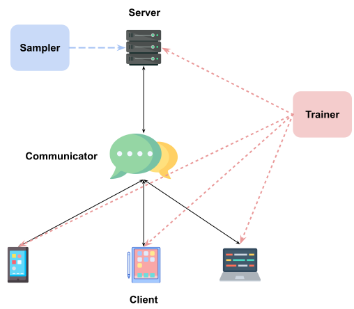

# ***fedlib* – A Federated Learning Experimental Python Library (V1 Design Overview)**

## **Introduction**

Running federated learning (FL) algorithms requires considerable efforts to set up the decentralized running environments in terms of both hardware and software dependencies.
It raises great challenges for Researchers to test their ideas. Especially in scaled federated learning, where thousands of edge clients may involved into communication, it would cause researcher spend tons of energy to configure every single edge client.

In ***fedlib***, we aim to provide federated learning engineers and developers a user-friendly federated learning platform to quickly test and run their customized FL algorithm. Additionally, we also target to provide developers easy to use APIs for deploying specialized FL models to real-world applications.

<!-- TODO: add image captions -->
<p align="center">

</p>

## **Design Overview**

Above figure shows the design overview of ***fedlib***. We designed 5 abstract classes `Sampler`, `Trainer`, `Server`, `Client`, and `Communicator` to implement the general functionality of federated learning, and provide the general federated learning virtual environments for various federated learning solutions.

### **`BaseServer`**

Functionality: [BaseServer](../src/fedlib/lib/server.py) is a general python class implemented for simulate the federated learning server.
Must initiate attributes with client sample function, global model, federated learning trainer, and communicator.


```Python
class Server:   
   
    @Necessary attributes:
   
    _global_model (nn.Module): global model at server
    _n_clients (int): number of clients
    _sample_fn (function): function for sample clients to communicate
    _trainer (Trainer): federated learning algorithm
    _communicator (Communicator): construct communication between edge and server
    _test_dataset (nn.DataLoader): test data

    @Optional attributes:
    _clients_credentials (HashMap): used for verify clients
    _server_credential (HashMap): server credential
    ...
```

## **`BaseClient`**

Functionality: [BaseClient](../src/fedlib/lib/client.py) is a general python class implemented for simulate the federated learning client.
Must initiate attributes with local model, local private data, federated learning trainer, local training components,and communicator.

```Python
class Client:   
   
    @Necessary attributes:
   
    id (int): client id
    _model (nn.Module): local model at client
    _trainer (Trainer): federated learning algorithm
    _communicator (Communicator): construct communication between edge and server
    _trainloader (nn.DataLoader): local training dataloader
    criterion (): loss function
    _optimizer (str): optimizer name


    @Optional attributes:
    _client_credential (HashMap): used for verify clients
    _server_credential (HashMap): server credential
    ...
```

## **`BaseTrainer`**

Functionality: [BaseTrainer](../src/fedlib/lib/algo/base/BaseTrainer.py) is a abstract python class implemented for the specific federated learning algorithm.
Inherent the class must rewrite the `local_updates()` and `aggregate()`  class functions.

```Python
class Triner:   
   
    @Must re-write the following functions:
   
    def local_updates(**kwargs)-> nn.Module
    
    def aggregate(**kwargs)->nn.Module
    ...
```

## **`BaseSampler`**

Functionality: BaseSampler (Abstract class under designing) is a abstract python class implemented for the specific the local clients sampling strategy.
We provide a function to randomly sample a partial clients into communication [RandomSampler](../src/fedlib/lib/sampler/random_sample.py).

```python
def random_sampler(n_clients, sample_rate):
    arr = np.arange(n_clients)
    np.random.shuffle(arr)
    selected = arr[:int(n_clients * sample_rate)]

    return selected
```

## **`BaseCommunicator`**

Functionality: `BaseCommunicator` (Abstract class under designing) is a abstract python class implemented for construct the communication between local clients and server.
We provide a instance class that inherit the `BaseCommunicator` and achieves the centralize federated learning simulation [RandomSampler](../src/fedlib/simulator/base/BaseSimulator.py).

The class method `run()` provide a fast debug environments for customize FL algorithms and baseline results reproduces.
```Python
def run(self,local_epochs):
        selected = self.server.client_sample(n_clients= self.n_clients, sample_rate=self.sample_rate)
        
        for round in range(self.communication_rounds):
            global_model_param = self.server.get_global_model_params()
            nets_params = []
            local_datasize = []
            self.logger.info('*******starting rounds %s optimization******' % str(round+1))

            for id in selected:
                self.logger.info('optimize the %s-th clients' % str(id))
                client = self.clients[id]
                if id != client.id:
                    raise IndexError("id not match")
                
                client.set_model_params(global_model_param)
                client.client_update( epochs=local_epochs)
                
                nets_params.append(client.get_model_params())
                local_datasize.append(client.datasize)

            self.server.server_update(nets_params=nets_params, local_datasize=local_datasize,global_model_param= global_model_param)
            self.server.eval()
```

## **User guide Visuals**

Demo: https://github.com/yusx-swapp/fedlib/blob/develop/src/eval.ipynb 

## Contribution

Sixing Yu: 

Framework design, FL baseline algorithms Implementation, demo implementation. 

Yixuan Wang: 

Abstract class (Client, Server, Communicator) implementation, Sampler implementation, demo debuging.

## Acknowledgment
Thanks for Yixuan Wang's help in discussion and docstring writing. 

